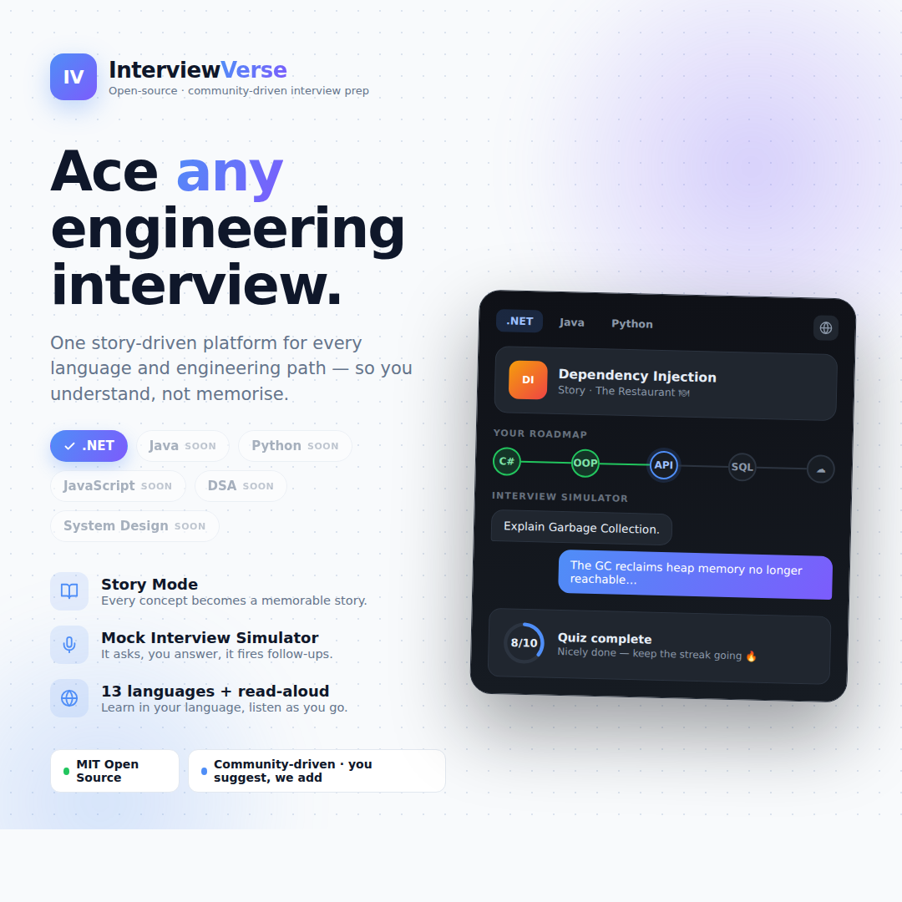

<!-- Replace Kamilmakwana with your GitHub username everywhere below. -->

<div align="center">

# 🎓 InterviewVerse

### Ace any engineering interview — through stories.

**InterviewVerse** is an open-source, story-driven, multilingual platform for **engineering
interview preparation**. Instead of a wall of *question → answer → forget*, every concept
becomes an animated story, with interactive diagrams, memory hacks, quizzes, flashcards,
and a realistic **mock interview simulator** — so you actually understand, not memorise.

We're **starting with a complete .NET track (126 questions)**, and growing into a home for
**every language and engineering path** — Java, Python, JavaScript/React, DSA, System
Design, DevOps and more — **added over time, with the community.**

[](LICENSE)
[](CONTRIBUTING.md)
[](https://github.com/Kamilmakwana/InterviewVerse/stargazers)
[](https://github.com/Kamilmakwana/InterviewVerse/network/members)
[](https://github.com/Kamilmakwana/InterviewVerse/issues)

[](https://nextjs.org/)
[](https://react.dev/)
[](https://www.typescriptlang.org/)
[](https://tailwindcss.com/)
[](https://www.framer.com/motion/)

[**✨ Live Demo**](https://your-demo-link.example) · [**🐛 Report Bug**](https://github.com/Kamilmakwana/InterviewVerse/issues) · [**💡 Suggest a Question / Track / Language**](https://github.com/Kamilmakwana/InterviewVerse/issues/new)

</div>

<!-- Add your promo image / screenshot here -->
<p align="center">
  
</p>

---

## 📌 Why InterviewVerse?

Most interview prep is a wall of *question → answer → forget*. InterviewVerse flips that.
Every concept becomes a **story** you can't unremember:

| Concept | Story |
|---|---|
| Dependency Injection | 🍽️ The Restaurant |
| Garbage Collection | 🧹 Hotel Housekeeping |
| Middleware | 🛂 Airport Security |
| JWT | 🎫 The Boarding Pass |
| SOLID | 🏗️ Building Construction |
| Stack / Queue | 🥞 Plates / 🎟️ Ticket Line |

You stop memorising and start **understanding** — which is exactly what interviewers test.
The engine is track-agnostic, so the same experience will power **every** language and path
we add.

---

## 🧭 Tracks

- ✅ **.NET — available now** · 126 questions across 12 worlds (C#, OOP, Advanced C#, ASP.NET Core, EF Core, SQL Server, Azure & DevOps, System Design, Coding Problems, Production Scenarios, Behavioral & .NET + AI).
- 🔜 **Coming next (community-driven):** Java, Python, JavaScript / React, DSA, System Design, DevOps, and more.

> Missing your language or topic? **Tell us** — comment, open an issue, or DM, and we'll add
> it. New tracks are built exactly like the .NET one: just data.

---

## ✨ Features (across every track)

- 🧠 **Real interview questions**, organised into themed "worlds".
- 📖 **Story-driven lessons** — a 14-step flow: question → story → analogy → explanation → interactive diagram → memory hack → company example → code → mistakes → follow-ups → quiz → summary → flashcard.
- 🎤 **Mock Interview Simulator** — an interviewer asks, you take a thinking timer, reveal the model answer, then field realistic follow-ups.
- 👑 **Boss Interviews** — timed, no-hints challenge at the end of each chapter, with score and stars.
- 🗺️ **Gamified roadmap** — a world map where completed chapters glow and unlock the next.
- ⚡ **Rapid Fire, Daily Challenge & Question Wheel** — fast, fun practice modes.
- 🎯 **Quizzes with instant feedback**, confetti, and progress rings.
- 🃏 **Flashcards & Revision Mode** — flip cards, 30-second & 2-minute recaps, pre-interview cheat sheet.
- 🧭 **Knowledge Map** — an interactive graph of how topics connect.
- 🏢 **Company Prep** — reorders lessons toward what specific companies emphasize.
- 🏆 **Progress, streaks, XP, achievements & spaced-repetition mastery** — saved locally in your browser.
- 🔍 **Command palette** (`⌘K` / `Ctrl+K`) for instant search and navigation.
- 🌍 **13 languages + read-aloud** — English, Hindi, Tamil, Telugu, Bengali, Marathi, Gujarati, Spanish, French, German, Portuguese, Arabic (RTL) & Chinese, with built-in text-to-speech.
- 🌗 **Dark / light / system themes**, responsive, and keyboard accessible.
- 🔒 **No login, no accounts, no database** — your progress just lives in your browser.

---

## 🚀 Getting started

No accounts, no environment variables, no services. Just:

```bash
git clone https://github.com/Kamilmakwana/InterviewVerse.git
cd InterviewVerse
npm install
npm run dev
```

Then open **http://localhost:3000**.

```bash
npm run build   # production build
npm run start   # serve the production build
```

**Requirements:** Node.js 18+.

---

## 🧱 Tech stack

**Next.js 14 (App Router)** · **React 18** · **TypeScript** · **Tailwind CSS** ·
**Framer Motion** · **Zustand** · **lucide-react** · **canvas-confetti**.
No server, no API, no database — everything is static + `localStorage`.

---

## 🗂️ Project structure

```
app/         # App Router pages (landing, home, roadmap, learn/[slug], interview, …)
components/  # ui/ primitives, lesson/, quiz/, flashcards/, interview/, roadmap/, graph/, layout/, shared/
lib/         # types, data (full lessons), lite (slim search index), chapters, companies, achievements, i18n
store/       # Zustand store (progress, bookmarks, theme, SRS, achievements) → localStorage
data/        # one JSON file per chapter + a generated slim search-index.json
messages/    # UI translations, one JSON file per language
```

Every lesson is a **JSON object** — adding content (and whole new tracks) is data, not code.
See **[CONTRIBUTING.md](CONTRIBUTING.md)**.

---

## 🗺️ Roadmap — *this is just the beginning*

- [ ] New **tracks**: Java, Python, JavaScript / React, DSA, System Design, DevOps, Go, and more
- [ ] Full **content translation** of lessons into the 13 UI languages
- [ ] More **UI languages** (community-suggested)
- [ ] A **track switcher** as more paths land
- [ ] **Community-suggested** questions and answers for every track
- [ ] Neural / higher-quality read-aloud voices (optional)
- [ ] Export progress & shareable results

Want a track or language prioritised? [Open an issue](https://github.com/Kamilmakwana/InterviewVerse/issues) or start a discussion.

---

## 🤝 Contributing

**InterviewVerse is community-driven and contributions are very welcome!** You don't need
to be an expert. The most valuable contributions are:

- 🧠 **New interview questions & answers** — for *any* language, framework, or engineering path.
- 🌍 **Language translations** for the interface (and, later, lesson content).
- 🧭 **New tracks** — propose a language/path you want covered.

Ways to help:

- 💬 Suggest a question, a track, or a language in the **[issues](https://github.com/Kamilmakwana/InterviewVerse/issues)**, in the comments on the launch post, or by DM.
- ⭐ **Star** the repo to support the project and help others find it.
- 🍴 **Fork** it and open a PR.

See **[CONTRIBUTING.md](CONTRIBUTING.md)** for the lesson JSON schema and step-by-step guides
(adding a question, a chapter, a whole track, or a language).

---

## ⭐ Support

If InterviewVerse helps your interview prep, please **star the repo** — it genuinely helps
the project reach more developers. Share it with anyone prepping for a tech interview.

---

## 📄 License

Released under the **[MIT License](LICENSE)** — free to use, learn from, and build on.

---

## 🙋 Author

Built by **[Kamil Makwana](https://github.com/Kamilmakwana)** as a personal open-source project.
Connect on [LinkedIn](https://www.linkedin.com/in/kamilmakwana/) · [GitHub](https://github.com/Kamilmakwana).

---

<sub><b>Keywords:</b> engineering interview preparation, coding interview practice, technical interview questions and answers, mock interview simulator, .NET / C# interview, Java interview, Python interview, JavaScript / React interview, DSA interview, system design interview, backend developer interview, open-source interview prep, learn to code through stories, Next.js learning platform, multilingual interview prep, flashcards, spaced repetition.</sub>
